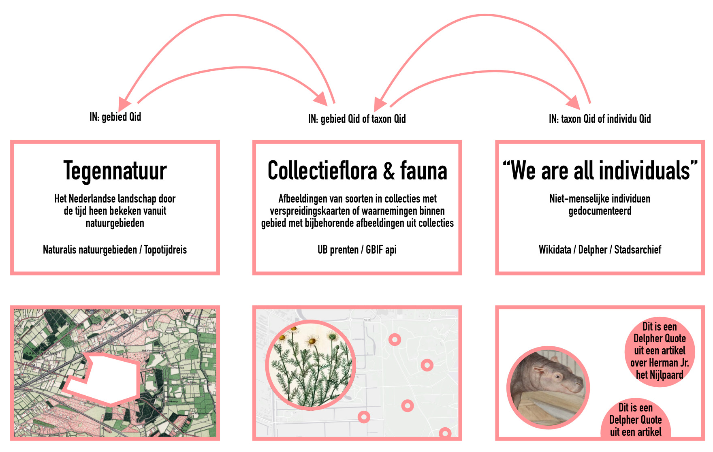

# hackalod22

Wat gaan we doen op de HackaLOD?

## Al gedaan:

- Natura2000 gebieden van Naturalis api verbonden met Wikidata identifiers, in [data/natura2000-met-wikidata.csv](data/natura2000-met-wikidata.csv)

## Databronnen

- Topotijdreis (tiles van jaar naar keuze zijn op te vragen)
- Naturalis [Biodiversity API](https://api.biodiversitydata.nl/), met o.a. [polygonen van 986 natuurgebieden](https://api.biodiversitydata.nl/v2/geo/query/?areaType=Nature&_size=10&_from=0)
- Ook op Wikidata zijn Natura2000-gebieden, bossen, natuurlandschappen, etc. te vinden, zoals bijv. de [Eilandspolder](https://www.wikidata.org/wiki/Q3183833), vaak met puntcoördinaat, soms met oppervlakte (in hectares) en Wikipediapagina.
- Commons bevat ook afbeeldingen van natuurgebieden, die in sommige gevallen al met genoemde Wikidata gebieden zijn verbonden. Via [commons-query.wikimedia.org](https://commons-query.wikimedia.org/) te bevragen.
- Vorig jaar hebben we op hetvolk een crowdsourceproject gedraaid waarin botanische prenten van de UvA UB met Wikidata taxons verbonden werden. Die data lijkt inmiddels opgenomen te zijn in de UB beeldbank data (koppeling gelegd met property <http://id.loc.gov/vocabulary/relators/dpc>). Deze [sample query](https://lod.uba.uva.nl/UB-UVA/-/queries/Botanic-gall-wasps/1) haalt afbeeldingen van verschillende soorten galwespen.
- [GBIF api](https://www.gbif.org/developer/summary), voor soorten en waarnemingen (met coordinaten).

## Links

- [Natuuramnesie](https://www.uu.nl/agenda/promotie-marc-argeloo-hoe-we-vergeten-zijn-hoe-de-natuur-er-vroeger-uitzag), proefschrift van Marc Argeloo

## Ideeën

Vorig jaar is er al geëxperimenteerd met een [landschappen applicatie](https://github.com/mmmenno/landschappen), waarin allerlei gegevens bij natuurgebieden (gegevens van Wikidata, Topotijdreis, Commons afbeeldingen, GBIF waarnemingen) werden gezocht. Meer een inventarisatie dan een 'killer-app'. Misschien moeten we ipv één applicatie 'waarin alles samenkomt' verschillende kleine applicaties maken die een bepaald deelaspect belichten?

Misschien geeft [https://hetwilde.nl/](https://hetwilde.nl/) ook nog ideeën. Trouwens, dat domein zouden we ook voor de hackalod kunnen gebruiken.

### Natuurgebieden + Topotijdreis

Het historisch besef is niet altijd even groot als het om veranderingen in het landschap gaat. Er wordt bijvoorbeeld wel beweerd dat 'er alleen maar landbouwgrond verdwijnt'. Goed om daar even historische kaart bij te pakken. Je kan daarop de contouren van de huidige Natura2000 gebieden leggen, maar interessanter is waarschijnlijk om de veranderingen (net) buiten die gebieden te laten zien.

### The Painted Planet

Als je van Commons afbeeldingen van natuurgebieden ophaalt, krijg je historische prenten, hedendaagse foto's, etc., zonder dat je daar goed onderscheid in kan maken. Op Wikidata staan (veel beter beschreven) schilderijen, maar daarvan zijn er niet zo veel gekoppeld aan natuurgebieden. Wat meer oplevert is gewoon alle 'landschapsschilderkunst' met een locatie opvragen. Resultaat daarvan zie je in [The Painted Planet](https://hicsuntleones.nl/paintedplanet/). Minpuntje: dit is al af.

### Niet-menselijke individuen

In het beschrijven van menselijke individuen zijn we heel goed, we koppelen collectiedata op allerlei manieren aan specifieke personen. Andere dieren (en ook bijv. bomen) beschouwen we, op onze huisdieren na, vaak enkel als (een exemplaar van een) soort. Op Wikidata zijn niet-menselijke individuen op te vragen (veel renpaarden). Maar er zijn ook boeken, zoals [Animal Biographies](https://ugapress.org/book/9780820362182/animal-biographies/) en een boek van iemand die historisch onderzoek heeft gedaan naar twintig monumentale bomen dat ik nu niet kan vinden. Op Wikidata is er een klasse 'bijzonder boom', waar o.a. de [Duizendjarige Den](https://www.wikidata.org/wiki/Q15943299) in valt. We zouden om het punt te maken een niet-menselijke familie op genealogie-online kunnen invoeren, bijv. op basis van [deze chimpansee stamboom](https://shigen.nig.ac.jp/gain/ViewIndividualFamilyTree.do?chim=true&zoo=7).

### Combinatie botanische prenten en waarnemingen

Je zou de botanische prenten (beschikbaar via IIIF) van de UB UvA kunnen combineren met de waarnemingen van die soorten in de gbif api, op een kaartje. Of omgekeerd, dat je de waarnemingen van een specifiek iemand (via iNaturalist api bijv.) pakt en daar prenten bij zoekt.
